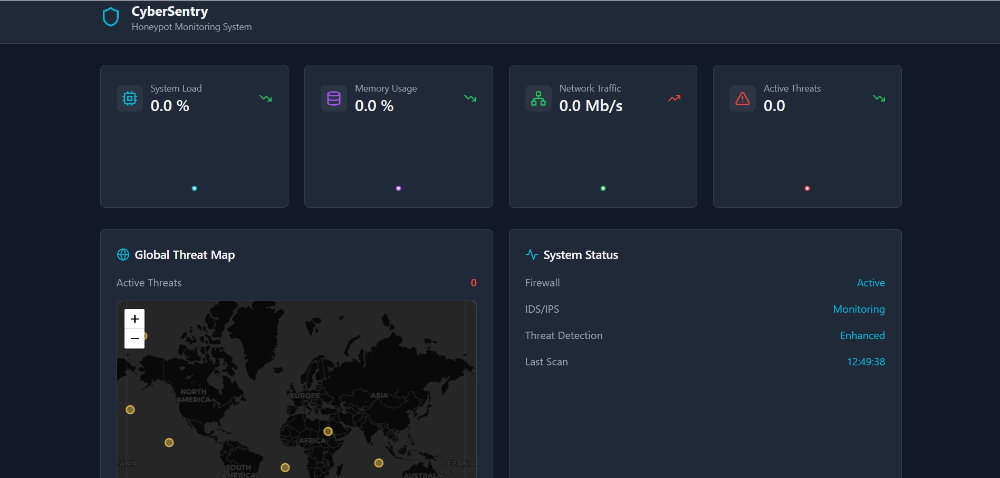
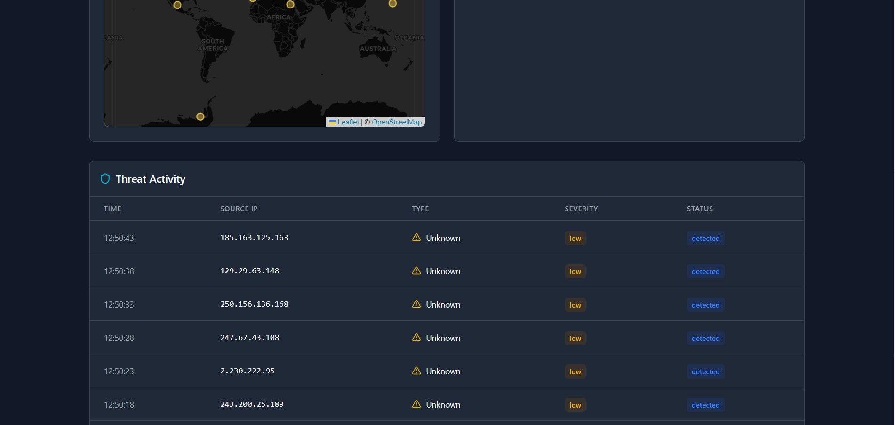

### Dashboard Overview

# Cybersentry Honeypot Monitoring System

The Honeypot Monitoring System is a real-time monitoring tool designed to detect, visualize, and analyze potential security threats and performance metrics in a secure environment. This system features interactive dashboards, attack visualizations, and detailed metrics tracking.

## Table of Contents
- [Features](#features)
- [Core Components](#core-components)
- [Data Services](#data-services)
- [Data Types & Interfaces](#data-types--interfaces)
- [Custom Hooks](#custom-hooks)
- [UI/UX Elements](#uiux-elements)
- [Technical Infrastructure](#technical-infrastructure)
- [Monitoring Metrics](#monitoring-metrics)
- [Setup Instructions](#setup-instructions)
- [Result Screenshots](#result-screenshots)

---

## Features
- Real-time attack detection and visualization
- Live monitoring of system performance metrics
- Geographic visualization of attack origins
- Integration with AbuseIPDB for IP reputation checks
- Classification and severity tracking of detected threats
- Intuitive and responsive dashboard UI

---

## Core Components
### **Dashboard**
Main container component displaying the overall system status, metrics, and visualizations.

### **MetricsCard**
Displays individual system metrics with real-time updates.

### **AttackList**
Sortable table component listing detected attacks and their details.

### **ThreatMap**
Visualizes attack origins on a global map using `react-leaflet`.

---

## Data Services
- **RealDataService**: Fetches real-time data via WebSocket and API calls.
- **AbuseIPDB Integration**: Checks the reputation of detected IPs.
- **WebSocket**: Ensures continuous live updates for system metrics.

---

## Data Types & Interfaces
- **Attack**: Represents attack data (IP, severity, origin, etc.).
- **SystemMetrics**: Defines key system performance metrics.
- **DataService**: Interface for consistent data service implementations.

---

## Custom Hooks
- **useDataService**: Manages WebSocket data subscriptions and state updates.
- **useMetricsHistory**: Tracks historical data for trend visualizations.

---

## UI/UX Elements
- Responsive and dynamic dashboard design
- Real-time data updates without page refresh
- Interactive threat map for detailed geographic insights
- Color-coded indicators for attack severity
- Status badges for tracking attack states
- Error handling and loading states

---

## Technical Infrastructure
- **React** with TypeScript for robust, type-safe development.
- **Tailwind CSS** for fast and customizable styling.
- **WebSocket** for efficient real-time updates.
- **Axios** for streamlined API communication.
- **Leaflet** for detailed map-based visualizations.
- **Recharts** for metrics and trend visualizations.

---

## Monitoring Metrics
The system monitors and displays the following metrics:
- CPU Usage
- Memory Usage
- Network Traffic
- Active Connections
- Attack Frequency
- Threat Severity Distribution

---

## Setup Instructions
1. Clone the repository:
   ```bash
   git clone <repository_url>
   ```
2. Install dependencies:
   ```bash
   npm install
   ```
3. Start the development server:
   ```bash
   npm run dev
   ```
4. To run the production build:
   ```bash
   npm run build
   ```
5. View the results in the browser at `http://localhost:3000`.

---

## Result Screenshots
### Threat Map

